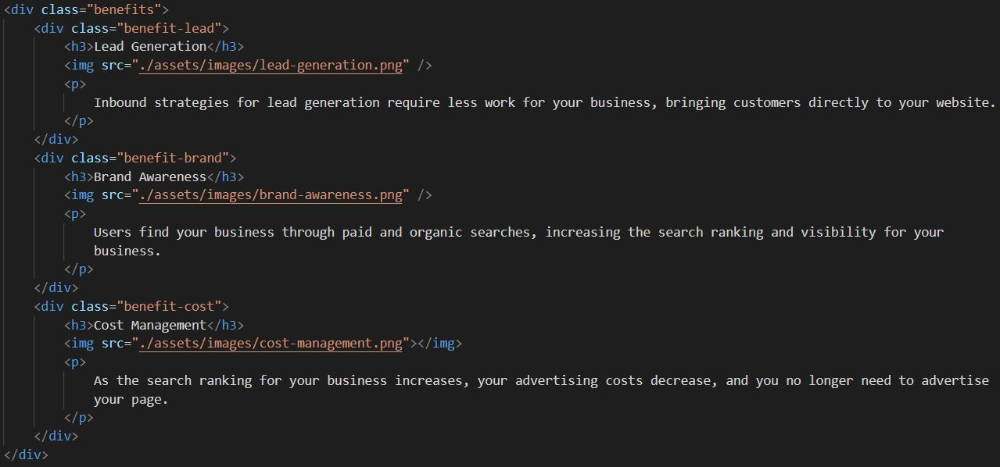
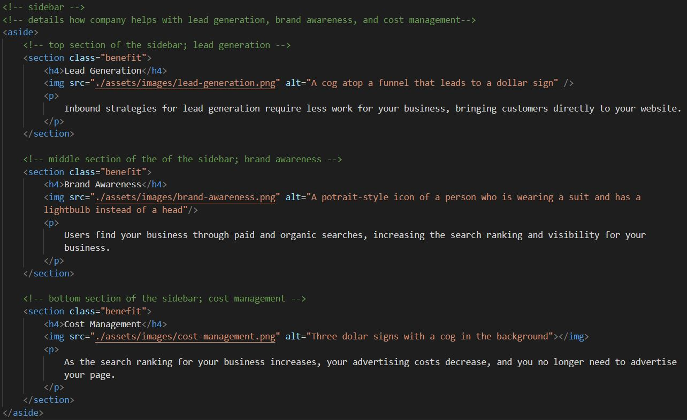

# Code Refactor

## An existing webpage whose code has been made accessible, clean, and consolidated. 

## Installation

If you wish to view the code, download this repository and open index.html in an IDE (such as VS Code), or open it in Google Chrome and inspect element using Chrome DevTools. 

## Usage

This project is meant to showcase what clean code looks like; I was provided initial code that was riddled with repetition and sloppy practices. 

Some of the changes that I made include: 

* Added alt text to all images 
* Added a descriptive, concise title for the website 
* Added semantic HTML elements 
* Modified the CSS so the selectors followed a logical order
* Added HTML and CSS comments 
* Reworked the code to make it less repetitive.

In order to make the code less repetitive, several changes had to be made. For example, in the stylesheet, the three sections on the sidebar were given separate classes with the same styling; I moved the styling to one class to apply to all three. 

Here is an example of what the code looked like before:

And after:

Note how the code is easier to read while adhering to accessibility standards. 

As for the stylesheet, the number of lines ended up being reduced by 31%. 

## Credits 

Original code provided by [Trilogy Education Services](https://www.trilogyed.com/)